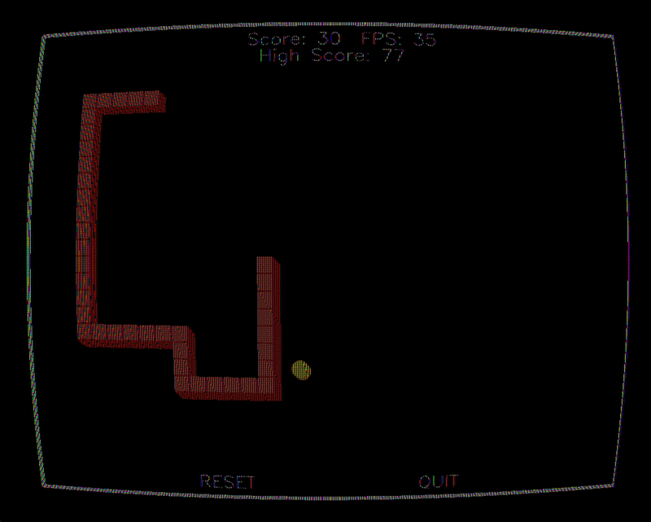

# ELEX 4618 - Advanced C++ Game Development Portfolio

[](https://en.cppreference.com/w/cpp/17)
[](https://www.opengl.org/)
[](https://opencv.org/)
[](LICENSE)

> **A comprehensive portfolio showcasing progressive C++ game development, from embedded systems integration to advanced 3D graphics programming.**

**Note**: While the code in this repository was developed independently with minimal AI assistance, this README was generated with AI assistance to better showcase the technical achievements and professional presentation.

## Featured Projects

### 3D Asteroids Game (Lab 6)
**Full 3D implementation with custom OpenGL graphics engine**


**Key Features:**
- Complete 3D graphics engine built from scratch
- Custom GLSL shaders with Phong lighting
- Multi-threaded architecture (60 FPS target)
- Real-time collision detection in 3D space
- Dynamic camera system with free-cam mode

---

### Advanced Snake Game V2 (Lab 5)
**Professional-grade 2D game with visual effects and audio**



**Key Features:**
- Multi-threaded architecture (4 separate threads)
- CRT visual effects with barrel distortion and scanlines
- SDL2 audio system with background music and sound effects
- Fixed 30 FPS with performance optimization

---

### Basic Snake Game (Lab 4)
**Clean 2D implementation with OpenCV rendering**

**Key Features:**
- OpenCV-based rendering system
- Microcontroller joystick control
- Collision detection and boundary wrapping
- Modular object-oriented architecture

---

### Embedded Control System (Lab 3)
**Serial communication protocol with TM4C123GH6PM microcontroller**

**Key Features:**
- Custom serial communication protocol
- Automatic port scanning and connection management
- Button debouncing and analog input processing
- Servo motor control with precise positioning

---

## Project Overview

This repository demonstrates advanced software engineering skills through a series of progressively complex game development projects. Built entirely in C++ without game engines, these projects showcase expertise in **multi-threading**, **3D graphics programming**, **real-time systems**, and **hardware integration**.

### Key Achievements
- **2,000+ lines** of production-quality C++ code
- **Multi-threaded architecture** with thread-safe operations
- **Custom 3D graphics engine** built from scratch
- **Real-time performance** optimization (30-60 FPS targets)
- **Professional documentation** with Doxygen
- **Hardware integration** via serial communication

---

## Technology Stack

| Category | Technologies |
|----------|-------------|
| **Languages** | C++17, GLSL (OpenGL Shading Language) |
| **Graphics** | OpenGL 4.1, GLFW, GLM (OpenGL Mathematics) |
| **Computer Vision** | OpenCV 4.10.0 |
| **Audio** | SDL2, SDL2_mixer |
| **Hardware** | Serial Communication, TM4C123GH6PM Microcontroller |
| **Tools** | Visual Studio 2022, Doxygen, Git |
| **Concepts** | Multi-threading, 3D Graphics, Real-time Systems, OOP Design Patterns |

---

## Project Structure

```
ELEX4618-Labs/
├── src/
│   ├── Lab3/          # Embedded Control & Serial Communication
│   ├── Lab4/          # Snake Game V1 (Basic Implementation)
│   ├── Lab5/          # Snake Game V2 (Advanced Features)
│   └── Lab6/          # 3D Asteroids Game
├── include/           # Header files with full Doxygen documentation
├── shaders/           # GLSL shader programs
├── resources/         # Game assets and audio files
└── html/             # Generated API documentation
```

---

## Architecture Highlights

### Multi-Threading Design
```cpp
// Example: Thread-safe game state management
std::mutex _game_mutex;
std::thread _gpio_thread;    // Hardware input
std::thread _update_thread;  // Game logic
std::thread _draw_thread;    // Rendering
std::thread _sound_thread;   // Audio processing
```

### 3D Graphics Pipeline
```cpp
// Example: 3D object rendering with lighting
void CGameObject::draw() {
    glUseProgram(_program_id);
    glUniformMatrix4fv(model_loc, 1, GL_FALSE, &_model_matrix[0][0]);
    glUniform3fv(light_pos_loc, 1, &_light_pos[0]);
    glDrawElements(GL_TRIANGLES, _indices.size(), GL_UNSIGNED_INT, 0);
}
```

### Hardware Integration
```cpp
// Example: Serial communication with error handling
bool CControl::get_data(int type, int channel, int& result) {
    std::string tx_str = "G " + std::to_string(type) + " " + std::to_string(channel) + "\n";
    // Implementation with timeout and error handling
}
```

---

## Performance Metrics

| Project | Lines of Code | FPS Target | Threads | Features |
|---------|---------------|------------|---------|----------|
| Lab 3 | ~200 | N/A | 1 | Serial Communication |
| Lab 4 | ~300 | 30 | 1 | Basic 2D Game |
| Lab 5 | ~800 | 30 | 4 | Advanced 2D Game |
| Lab 6 | ~1,200 | 60 | 4 | 3D Graphics Engine |

---

## Documentation

Complete API documentation is available at: **[Live Documentation](https://bradenvanderwoerd.github.io/ELEX4618-Labs/)**

The documentation includes:
- **Class hierarchy** and inheritance relationships
- **Function documentation** with parameters and return values
- **Code examples** and usage patterns
- **Architecture diagrams** and design patterns

---

## Software Engineering Principles Demonstrated

- **Object-Oriented Design**: Clean inheritance hierarchies and polymorphism
- **SOLID Principles**: Single responsibility, open/closed, dependency inversion
- **Design Patterns**: Template method, observer, factory patterns
- **Resource Management**: RAII principles and smart pointer usage
- **Error Handling**: Comprehensive exception handling and validation
- **Performance Optimization**: Profiling, threading, and algorithmic efficiency
- **Code Documentation**: Professional API documentation with Doxygen
- **Version Control**: Git workflow and branching strategies

---

## Future Enhancements

- [ ] Cross-platform compatibility (Linux/macOS)
- [ ] Additional shader effects (particle systems, post-processing)
- [ ] Network multiplayer support
- [ ] VR/AR integration
- [ ] Mobile port using OpenGL ES

---

## License

This project is licensed under the MIT License - see the [LICENSE](LICENSE) file for details.

---

## Author

**Braden Vanderwoerd** - [GitHub Profile](https://github.com/bradenvanderwoerd)

*This portfolio represents advanced software engineering skills in C++ game development, demonstrating expertise in multi-threading, 3D graphics programming, and real-time systems development.*

---

*[Footer placeholder: Contact information and additional links]* 
